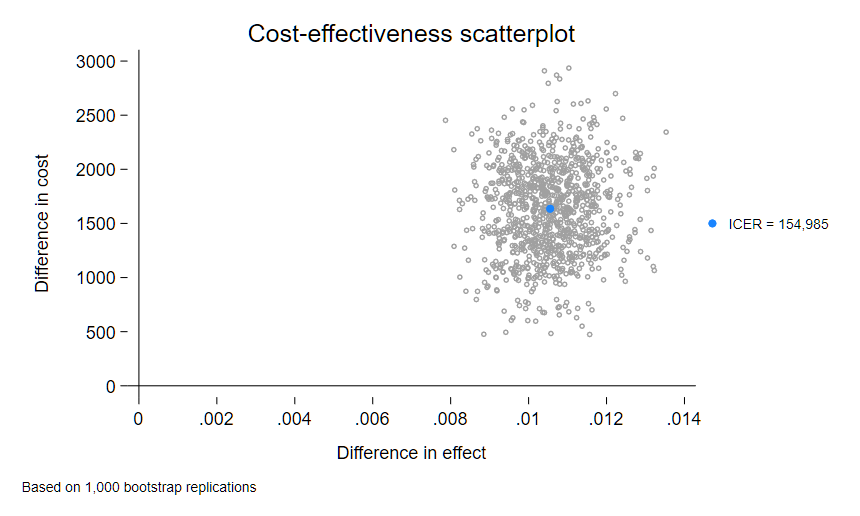
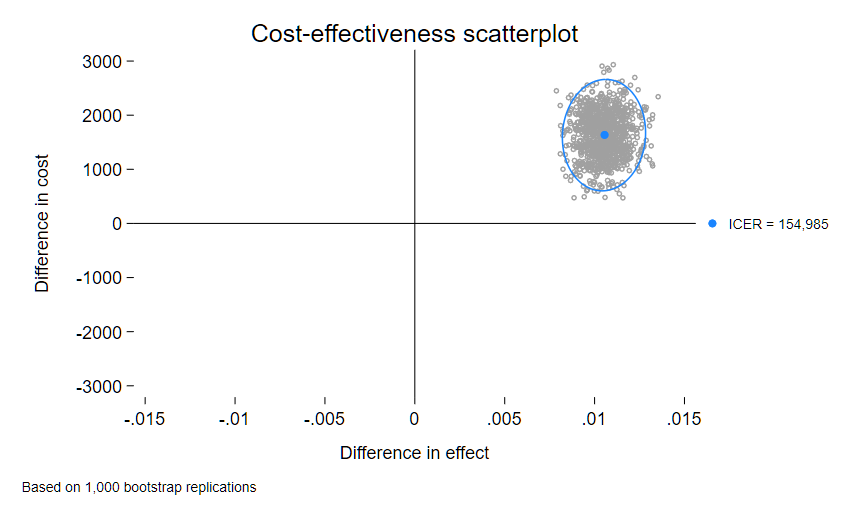
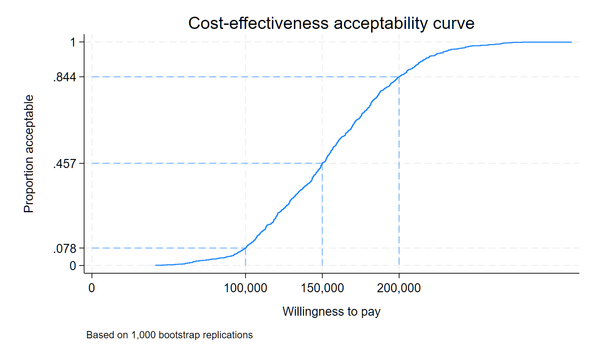

# Trial-based CEA commands for Stata
This repository holds Stata commands to conduct cost-effectiveness analyses for clinical trials. All commands currently assume that data come from a randomized controlled trial (RCT) and that analyses will be conducted within-trial. Decision tree and Markov models that rely on sampling from probability distributions are not currently supported. Stata version 18.0 or higher is required.

## Overview of available commands
The **cea** command suite is for commands that require data in memory and the **ceai** commands are a subset of immediate-form commands for univariate analyses. **ceagraph** is for plotting results.

The **cea** suite of commands support the following:
* Calculation of the incremental cost-effectiveness ratio (ICER) 
* Computation of net monetary benefit (NMB)
* Adjusted and unadjusted analyses
* A wide variety of relevant cost and effect models, including GLM and beta regression models
* Bootstrapped confidence intervals (percentile, ordered replicate, and normal-based)
* Hypothesis testing
* Control over the analyzed treatment and control levels for multivalued treatments
* Plotting of customizable CEA-related graphs via **ceagraph**

### Data requirements
The **cea** commands require, at a minimum, 3 variables with patient-level data: cost, some measure of effect or outcome (e.g., quality-adjusted life years, depression free days), and an indicator of treatment group assignment. Data must contain only one observation per patient or be restricted using **if**.

The **ceai** commands require only that you provide sample sizes for each group, group mean cost and effect (or the difference between groups), and measures of within- and inter-group variability.
#### Valid treatment values
The treatment assignment variable specified in **treatment()** may have any number of values, but they must conform to Stata's requirements for [factor variables](https://www.stata.com/manuals/u26.pdf). If you have string data, real (non-integer) numbers, or negative values for your treatment, you must either [encode](https://www.stata.com/manuals/encode.pdf)/[recode](https://www.stata.com/manuals/recode.pdf) these or use an **if** condition to exclude them from the analysis. 
#### Handling of missing data
**cea** enforces equal numbers of observations on cost and effect. Observations with missing data are excluded by the program by default. That is, the command is only capable of complete case analysis in its current form. 

## Tour of cea
The **cea** command can be used for either univariate or multivariate analysis of cost-effectiveness. The examples come from a hypothetical trial of 2,000 patients allocated with 50% probability to either the treatment group (**tgroup**=1) or the control group (**tgroup**=0) where **cost** and quality-adjusted life years (**qaly**) were collected on all subjects. Each subject's age was collected at randomization.
```
. describe

Contains data from dta/rct2armex2.dta
 Observations:         2,000                  Balanced 2-arm RCT data with
                                                covariate (simulated)
    Variables:             6                  14 Mar 2024 08:41
-------------------------------------------------------------------------------
Variable      Storage   Display    Value
    name         type    format    label      Variable label
-------------------------------------------------------------------------------
subjid          int     %9.0g                 Subject ID
tgroup          byte    %9.0g      tgroup     Treatment assignment
age             double  %10.0g                Age at randomization (years)
qaly            double  %10.0g                QALYs
cost            double  %10.0g                Cost (US $)
lncost          double  %10.0g                Log of cost
-------------------------------------------------------------------------------
```
### Unadjusted analysis
The most basic use of the **cea** command estimates the ICER from unadjusted arithmetic means. To conduct this analysis, you need only specify your cost and outcome variables, in that order, as the _varlist_ for **cea**. The variable indicating treatment assignment is specified in the required **treatment()** option, which may be abbreviated to **treat()**.  
```
. cea cost qaly, treat(tgroup)
(running cea on estimation sample)

Bootstrap replications (50)
----+--- 1 ---+--- 2 ---+--- 3 ---+--- 4 ---+--- 5 
..................................................    50

Cost effectiveness analysis
Design type  : RCT                                  Number of obs      = 2,000
Cost model   : arithmetic mean                      Number of controls = 1,001
Effect model : arithmetic mean                      Number treated     =   999
------------------------------------------------------------------------------
             |   Observed   Bootstrap                         Normal-based
        ICER | coefficient  std. err.      z    P>|z|     [95% conf. interval]
-------------+----------------------------------------------------------------
      tgroup |
 (Treatment  |
         vs  |
   Control)  |   148417.6   46561.05     3.19   0.001     57159.64    239675.6
------------------------------------------------------------------------------
```
The estimated ICER is about $148,418 with a normal-based 95% confidence interval of $57,159 to $239,675 with the default 50 bootstrap replications. The **cea** header shows the total number of observations and the number in each treatment condition. The header also shows that cost and effect are both modeled with the arithmetic mean. And it reminds you that the command assumes the data comes from an RCT.
### Controlling treatment levels
**cea** assumes the lowest value of the treatment assignment variable is the control or reference condition and the next lowest value is the treatment condition. You may change this behavior by specifying the value or [label](https://www.stata.com/manuals/dlabel.pdf) of the level that should be the control in **control()**. 
```
. cea cost qaly, treat(tgroup) control(1)
```
You can likewise change the specification of the experimental treatment with **tlevel()**.
```
. cea cost qaly, treat(tgroup) tlevel(0)
```
With only two possible treatment conditions, specifying either **control()** or **tlevel()** implies that the other value is used at the treatment or control level. For multivalued treatments, both options must be specified.
### Bootstrapping
Standard errors are bootstrapped using the Stata default specifications. The **cea** command ensures that replicates are selected with the same allocation of subjects to treatment conditions. It also will not resample from any observations excluded from the initial analysis using an **if** condition. You may customize calculation of bootstrapped standard errors by specifying suboptions to **vce(bootstrap)**; see [\[R\] bootstrap](https://www.stata.com/manuals/rbootstrap.pdf) for a list of supported suboptions. 

For example, specifing **seed(1423)** ensures the results can be replicated. The **dots(10)** suboption limits printing of the replication dots to one every 10 replications. 
```
. cea cost qaly, treat(tgroup) vce(bootstrap, seed(1423) dots(10))
(running cea on estimation sample)

Bootstrap replications (100): .........100 done

Cost effectiveness analysis
Design type  : RCT                                  Number of obs      = 2,000
Cost model   : arithmetic mean                      Number of controls = 1,001
Effect model : arithmetic mean                      Number treated     =   999
------------------------------------------------------------------------------
             |   Observed   Bootstrap                         Normal-based
        ICER | coefficient  std. err.      z    P>|z|     [95% conf. interval]
-------------+----------------------------------------------------------------
      tgroup |
 (Treatment  |
         vs  |
   Control)  |   148417.6   42953.71     3.46   0.001     64229.89    232605.4
------------------------------------------------------------------------------
```
#### Obtain percentile-based confidence interval for bootstrapped SEs
**cea** reports a normal-based confidence interval for bootstrapped standard errors. To view percentile-based standard errors instead,  use postestimation command **estat bootstrap**. 
```
. estat bootstrap, percentile

Cost effectiveness analysis                     Number of obs     =      2,000
                                                Replications      =        100
------------------------------------------------------------------------------
             |    Observed               Bootstrap
        ICER | coefficient       Bias    std. err.  [95% conf. interval]
-------------+----------------------------------------------------------------
r1vs0.tgroup |   148417.62  -4939.849   42953.712    62951.72   226323.8   (P)
------------------------------------------------------------------------------
Key: P: Percentile
```
#### Alternate delta-method standard errors
To use analytic standard errors computed via the delta method instead of bootstrapping, use option **vce(delta)**. 
```
. cea cost qaly, treat(tgroup) vce(delta)

Cost effectiveness analysis
Design type  : RCT                                  Number of obs      = 2,000
Cost model   : arithmetic mean                      Number of controls = 1,001
Effect model : arithmetic mean                      Number treated     =   999
------------------------------------------------------------------------------
             |                Delta
        ICER | Coefficient  std. err.      t    P>|t|     [95% conf. interval]
-------------+----------------------------------------------------------------
      tgroup |
 (Treatment  |
         vs  |
   Control)  |   148417.6   42636.23     3.48   0.001     64801.49    232033.8
------------------------------------------------------------------------------
```
The delta method standard error and confidence interval are quite close to the bootstrapped values in this case. 

### Net monetary benefit
While the default estimand is the ICER, the NMB is available as an alternate if option **wtp()** is specified instead. Letting _w_ indicate the willingness to pay, net monetary benefit is computed as NMB = $w$ * $\Delta E - \Delta C$. This quantity is computed rather than $\Delta C / \Delta E$. 
```
. cea cost qaly, treat(tgroup) wtp(200000)
(running cea on estimation sample)

Bootstrap replications (50): .........10.........20.........30.........40......
> ...50 done

Cost effectiveness analysis
Design type  : RCT                                  Number of obs      = 2,000
Cost model   : arithmetic mean                      Number of controls = 1,001
Effect model : arithmetic mean                      Number treated     =   999
------------------------------------------------------------------------------
             |   Observed   Bootstrap                         Normal-based
         NMB | coefficient  std. err.      z    P>|z|     [95% conf. interval]
-------------+----------------------------------------------------------------
      tgroup |
 (Treatment  |
         vs  |
   Control)  |   541.4579   464.8073     1.16   0.244    -369.5477    1452.463
------------------------------------------------------------------------------
```
At a specified $200,000 willingness to pay, the NMB is an estimated $541.46. 

### Multivariable analyses
The multivariable version of **cea** has the same functionality as the simpler syntax, but it lets you specify models for the cost and outcomes when computing the ICER. The same command need not be used and different covariates are permitted. For example, suppose you want to specify a GLM model with a gamma family and log link for the cost and use beta regression for the QALYs. You can estimate this model by providing the corresponding Stata estimation commands to **cea**. 
```
. cea (glm cost age, family(gamma) link(log)) ///
>     (betareg qaly age), treat(tgroup) ///
>     vce(boot, seed(1423) reps(1000) dots(100))
(running cea on estimation sample)

Bootstrap replications (1,000)
----+--- 1 ---+--- 2 ---+--- 3 ---+--- 4 ---+--- 5 
..........

Cost effectiveness analysis
Design type  : RCT                                  Number of obs      = 2,000
Cost model   : glm                                  Number of controls = 1,001
Effect model : betareg                              Number treated     =   999
------------------------------------------------------------------------------
             |   Observed   Bootstrap                         Normal-based
        ICER | coefficient  std. err.      z    P>|z|     [95% conf. interval]
-------------+----------------------------------------------------------------
      tgroup |
 (Treatment  |
         vs  |
   Control)  |   154985.4    42552.2     3.64   0.000     71584.65    238386.2
------------------------------------------------------------------------------
```
The revised ICER estimate is $154,985 with a normal-based 95% CI of $71,584 to $238,386. The header output changes to reflect that **glm** was used to obtain adjusted estimates of cost and **betareg** for the outcome. 
## Overview of ceagraph
After estimating the ICER, we most likely want to plot two common graphs used for CEA. To obtain a plot of the bootstrap replications and the point estimate of the ICER, all we need to do is type
``
. ceagraph scatter
``
after our **cea** command. This produces the default plot shown below in Stata 18; plots in later Statas may look different if the Stata defaults change.
 

All the usual **twoway** options may be used to further customize the aspects of the graph like title, axis labels, and legend. However, there are also custom options for the cost-effectiveness scatterplot. For example, we could add a 95% confidence ellipse with the **ellipse** option and display all four quadrants of the cost-effectiveness plane with the **quadrants** option.
```
. ceagraph scatter, ellipse quadrants
```


We can also plot the cost-effectiveness acceptability curve with **ceagraph accept**. The **wtp()** option specifies that **ceagraph** adds droplines from the CEAC at the specified willingness-to-pay values and draw lines to the corresponding proportion acceptable. 



## Reference
Glick, H. A., Doshi, J. A., Sonnad, S. S., & Polsky, D. (2014). Economic evaluation in clinical trials. OUP Oxford. https://doi.org/10.1093/med/9780199685028.001.0001

## Authors
Rebecca A. Raciborski, PhD

Rafal Raciborski, MA

## Acknowledgement
Dr. Raciborski developed an early version of the mean-only **cea** command as part of her work on the PRIME Care (PRecision medicine In MEntal health care) study; U.S. Department of Veterans Affairs Health Services Research and Development Grant (#1P1 HX002375-01/ SDR 16-348). The command was later re-written and all subsequent development done without financial support from the VA.  No warranty is expressed or implied and the views presented are those of the authors alone and do not necessarily represent those of the U.S. government or the funding agency.

## Bugs and new feature requests
If you find a bug, please submit an issue via GitHub [Issue](https://github.com/TheRaciborskis/cea/issues/new). Be sure to describe exactly what is going wrong, what you expected to see instead, and provide code for us to replicate the problem. Select "Bug" as the label when you submit. 

You can also request new featues by submitting an issue with the enhancement label. 
